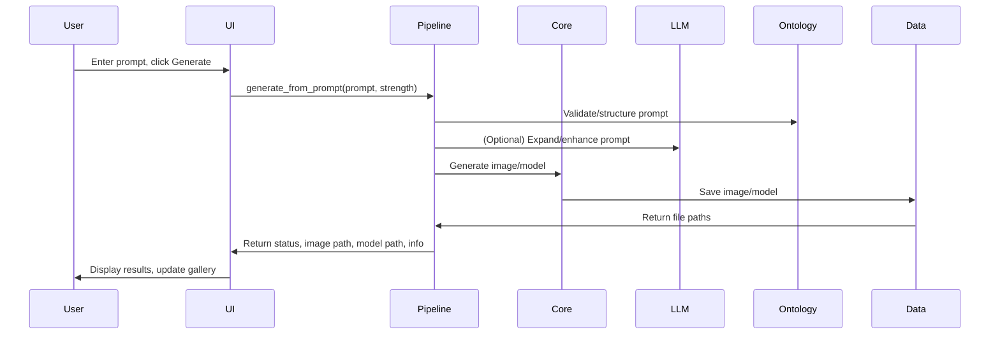

# ShapeForge

ShapeForge is an end-to-end pipeline for generating 3D models from text prompts, leveraging cutting-edge AI technologies including text-to-image generation and image-to-3D model transformation.


### Sequence Diagram



## Features

- **Text-to-Image Generation**: Convert descriptive text prompts into detailed, high-quality images
- **Text Prompt Enhancement**: Automatically enhance user prompts for better results using LLM
- **Image-to-3D Conversion**: Transform 2D images into textured 3D models in GLB format
- **Video Preview**: Generate video previews of the 3D models for quick visualization
- **User-friendly Interface**: Simple web UI for interacting with the application
- **Openfabric Integration**: Leverages Openfabric's powerful AI applications ecosystem
- **Memory Management**: SQLite-based persistence system for storing generated assets
- **Debug Mode**: Comprehensive logging and debugging capabilities

## System Requirements

- Python 3.10+
- 8GB RAM (16GB+ recommended for larger models)
- Modern CPU (GPU recommended for improved performance)
- 1GB free disk space for the application and generated assets
- 13GB free disk space for the LLM model (if downloaded)
- Internet connection (for Openfabric API access)
- Operating Systems: Windows 10/11, macOS, Linux

## Default Model Configuration

- The LLM used is the `meta-llama/Llama-3.2-3B-Instruct` model, which is a lightweight version of the Llama-3.2 model. It is designed to run on consumer-grade hardware with 8GB of RAM. The model is capable of enhancing text prompts for better image generation results.

- This is a gated model; you would need your Hugging Face token to access it. You can request access to the model [here](https://huggingface.co/meta-llama/Llama-3.2-3B-Instruct).

- The model is downloaded using the `download_model.sh` script, which uses the `huggingface-cli` to authenticate and download the model files. Set your Hugging Face token in the `.env` file before running the script.

- If you don't want to add your Hugging Face token, the application will fall back to using non-gated models:

```
    fallback_models = [
        "mistralai/Mistral-7B-Instruct-v0.2",
        "microsoft/Phi-3-mini-4k-instruct",
        "google/gemma-2b-it",
    ]
```

## Hosted Demo

You can try out a hosted version of ShapeForge at [ShapeForge Studio](https://huggingface.co/spaces/Zoro-chi/ai-creative-studio). This demo allows you to test the application without needing to set it up locally.

**Note on Hosted Version**: The hosted demo on Huggingface Spaces operates with certain limitations due to free-tier restrictions. It uses the more compact `TinyLlama-1.1B-Chat` model, resulting in less coherent prompt expansions compared to the local version. Performance differences are significant - the hosted version takes approximately **2 minutes** to complete text-to-3D model generation, while the local version completes the same process in **under 1 minute**. For the optimal experience with higher quality results and faster processing times, we strongly recommend running ShapeForge locally on your machine.

## Installation

### 1. Clone the repository

```bash
git clone https://github.com/shreyanshtri26/ShapeForge.git
cd ShapeForge
```

### 2. Create a Python virtual environment

```bash
# Using conda
conda create -n shapeforge-py310 python=3.10
conda activate shapeforge-py310

# OR using venv
python -m venv venv
source venv/bin/activate  # On Windows: venv\Scripts\activate
```

### 3. Install dependencies

```bash
pip install -r requirements.txt
```

### 4. Download the LLM model (optional but **recommended**)

Model size is approximately 13GB.
To use the local LLM for prompt enhancement:

```bash
bash download_model.sh
```

### 5. Set up environment variables

Create a `.env` file in the project root using the provided template:

```bash
cp .env.example .env
```

Configure the following key variables in your `.env` file:

```env
# PyTorch settings for Apple Silicon
PYTORCH_ENABLE_MPS_FALLBACK=1

# Hugging Face token for downloading models
HF_TOKEN=your_huggingface_token_here

# LLM Service Configuration
MODEL_ID=meta-llama/Llama-3.2-3B-Instruct
MODEL_PATH=model/path/to/your/model

# Service URLs
LLM_SERVICE_URL=http://localhost:8001

# Openfabric App IDs
TEXT_TO_IMAGE_APP_ID=f0997a01-d6d3-a5fe-53d8-561300318557
IMAGE_TO_3D_APP_ID=69543f29-4d41-4afc-7f29-3d51591f11eb

# Storage Configuration
IMAGE_OUTPUT_DIR=app/data/images
MODEL_OUTPUT_DIR=app/data/models

# Memory Configuration
MEMORY_TYPE=sqlite
MEMORY_DB_PATH=app/data/memory.db

# UI Configuration
UI_PORT=3000
STREAMLIT_PORT=8501

# Logging
LOG_LEVEL=INFO
LOG_FILE=app/logs/app.log

# Development Flags
DEBUG_MODE=True
ENABLE_MEMORY=True
ENABLE_GUI=False
```

## Usage

### Starting the LLM Service

Start the local LLM service first:

```bash
python app/llm/service.py
```

Wait for the model to load (you should see "LLM initialized successfully" in the console).

### Running the UI Application

In a new terminal window:

```bash
python app/ui/app.py
```

This will launch the web interface, accessible at [http://localhost:3000](http://localhost:3000) (or the port specified in your `UI_PORT` configuration).

### Using the Application

1. **Enter a prompt**: Enter a descriptive text prompt for the 3D model you want to create
2. **Generate**: Click the "Generate" button to start the creation process
3. **View results**: The application will display:
   - The original prompt
   - The enhanced prompt (if LLM enhancement worked)
   - The generated image
   - The 3D model viewer with the created model
   - Download links for both image and 3D model


## Memory Implementation

ShapeForge implements a sophisticated memory management system with multiple backend options for storing generated assets and their metadata. This allows the application to maintain a history of creations and reload them even after application restarts.

### Memory Backend Options

The application supports three memory backend types, configurable via the `MEMORY_TYPE` environment variable:

- **SQLite** (default): File-based SQL database for structured data storage
- **Redis**: In-memory data structure store for high-performance caching
- **File**: Simple file-based JSON storage for lightweight deployments

### SQLite Memory Backend

When using `MEMORY_TYPE=sqlite`:

1. **Database Location**: The SQLite database is stored at `MEMORY_DB_PATH` (default: `app/data/memory.db`)
2. **Structured Storage**: Assets are stored in normalized tables with proper relationships
3. **Metadata Management**: Full metadata tracking including timestamps, prompts, and generation parameters
4. **Query Capabilities**: Advanced search and filtering options for asset retrieval

### Asset Storage

#### Image Storage

When a text-to-image generation is completed:

1. **Image Files**: Generated images are saved in the `IMAGE_OUTPUT_DIR` directory as PNG files
2. **Database Records**: Image metadata is stored in the memory backend
3. **Metadata Content**: The metadata includes:
   - Original prompt
   - Enhanced prompt
   - Timestamp
   - Generation parameters
   - Result IDs from Openfabric
   - Download status

Example of image metadata in SQLite:

```sql
CREATE TABLE images (
    id INTEGER PRIMARY KEY AUTOINCREMENT,
    original_prompt TEXT NOT NULL,
    enhanced_prompt TEXT,
    file_path TEXT NOT NULL,
    timestamp INTEGER NOT NULL,
    result_id TEXT,
    download_status TEXT DEFAULT 'completed'
);
```

#### Model Storage

For 3D model generation:

1. **Model Files**: Generated 3D models are saved in the `MODEL_OUTPUT_DIR` directory as GLB files
2. **Database Records**: Model metadata is stored with references to source images
3. **Metadata Content**: The model metadata includes:
   - Source image reference
   - Model format (GLB)
   - Timestamp
   - Generation parameters
   - Video preview path (if available)

### Persistence and Loading

- **Automatic Persistence**: All assets and metadata are automatically saved to the configured memory backend
- **Directory Structure**: The application maintains a clean directory structure with separate folders for images and models
- **Auto-discovery**: When the application starts, it loads existing assets from the memory backend
- **UI Integration**: Previously generated assets are accessible through the galleries in the UI
- **Download Management**: For remotely stored assets, the application tracks download status and can retrieve them when needed

### Blob Storage Integration

The application handles remote assets stored in Openfabric's blob storage:

1. When an image or model is generated, it may initially exist only as a reference to a remote blob
2. The application downloads these blobs as needed and stores them locally
3. The memory backend is updated to reflect the local storage path once downloaded

## Architecture

ShapeForge consists of several key components:

- **Core Pipeline**: Orchestrates the end-to-end creative workflow
- **LLM Service**: Enhances text prompts using a local language model
- **Text-to-Image Service**: Generates images from text (via Openfabric)
- **Image-to-3D Service**: Creates 3D models from images (via Openfabric)
- **Memory Management**: Configurable persistence layer for asset storage
- **Web UI**: Modern web interface for user interaction

The application uses Openfabric's platform for the compute-intensive image and 3D model generation tasks, while running a lightweight LLM locally for prompt enhancement.

## Configuration Options

### Memory Configuration

Configure memory backend in your `.env` file:

```env
# Memory backend type: sqlite, redis, or file
MEMORY_TYPE=sqlite

# SQLite database path (when using sqlite backend)
MEMORY_DB_PATH=app/data/memory.db

# Enable/disable memory functionality
ENABLE_MEMORY=True
```

### UI Configuration

Configure the user interface:

```env
# Main UI port
UI_PORT=3000

# Optional Streamlit port (if using Streamlit GUI)
STREAMLIT_PORT=8501

# Enable optional GUI features
ENABLE_GUI=False
```

### Development Configuration

Configure development and debugging options:

```env
# Enable debug mode for detailed logging
DEBUG_MODE=True

# Logging configuration
LOG_LEVEL=INFO
LOG_FILE=app/logs/app.log
```

## Logging

ShapeForge maintains detailed logs in the following locations:

- `app/logs/app.log`: Main application logs
- `app/core/openfabric_service.log`: Logs for Openfabric service operations
- `app/llm/llm_service.log`: Logs for the local LLM service

Log level can be configured via the `LOG_LEVEL` environment variable (DEBUG, INFO, WARNING, ERROR).

## Troubleshooting

### Common Issues

- **LLM Service not starting**: Ensure you have sufficient RAM for the model, and check that the model download was completed successfully
- **Connection errors**: Verify your internet connection and check that your Openfabric app IDs are correct
- **Generation timeout**: Image or 3D model generation may take time, depending on complexity and service load
- **"No module found" errors**: Ensure all dependencies are installed and you're using the correct Python environment
- **Memory backend errors**: Check that the configured memory backend (SQLite/Redis) is properly set up and accessible
- **Port conflicts**: If the default ports are in use, modify `UI_PORT` and `LLM_SERVICE_URL` in your `.env` file

### Debug Mode

Enable debug mode for detailed troubleshooting:

```env
DEBUG_MODE=True
LOG_LEVEL=DEBUG
```

This will provide verbose logging to help identify issues during development and deployment.

## Contributing

We welcome contributions to ShapeForge! Please feel free to submit issues, feature requests, or pull requests to help improve the project.
