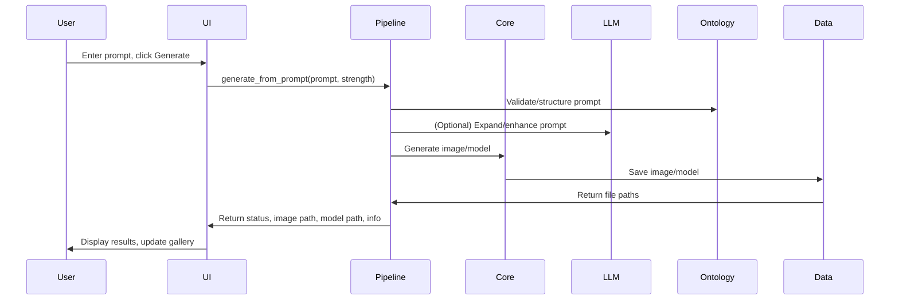
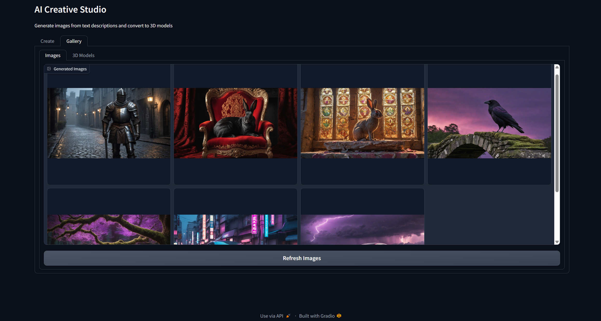
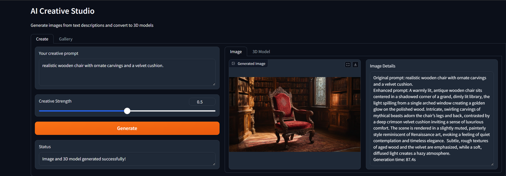
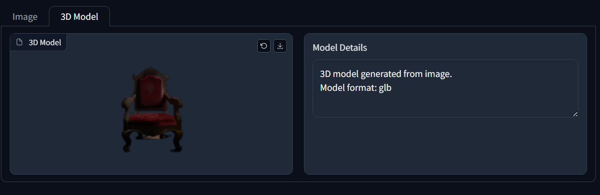
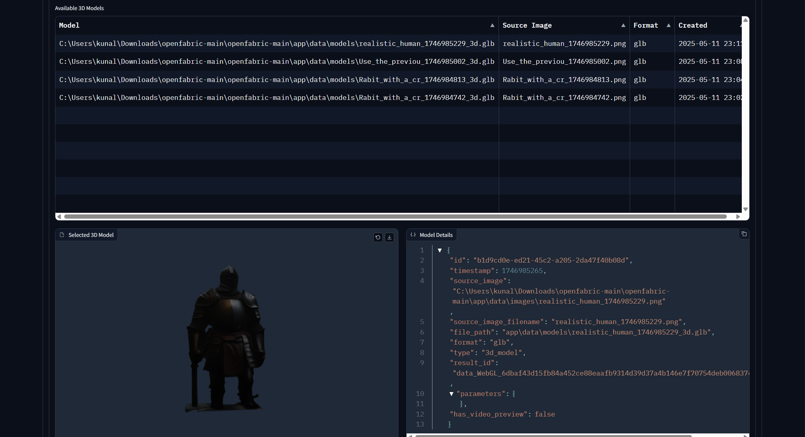

# ShapeForge

ShapeForge is an end-to-end pipeline for generating 3D models from text prompts, leveraging advanced AI for text-to-image and image-to-3D model transformation.


### Sequence Diagram



## Features

- **Text-to-Image Generation**: Turn descriptive text prompts into high-quality images.
- **Prompt Enhancement**: Automatically improve user prompts using an LLM.
- **Image-to-3D Conversion**: Convert 2D images into textured 3D models (GLB format).
- **Video Preview**: Generate video previews of 3D models.
- **User Interface**: Simple web UI for easy interaction.
- **Openfabric Integration**: Utilizes Openfabric's AI ecosystem.
- **Memory Management**: Persistent storage for generated assets.
- **Debug Mode**: Comprehensive logging and debugging tools.

## System Requirements

- Python 3.10+
- 8GB RAM (16GB+ recommended)
- Modern CPU (GPU recommended)
- 1GB free disk space for app and assets
- 13GB free disk space for the LLM model
- Internet connection (for Openfabric API)
- Windows 10/11, macOS, or Linux

## Default Model Configuration

- The default LLM is `meta-llama/Llama-3.2-3B-Instruct`, designed for consumer hardware with 8GB+ RAM. It enhances prompts for better image generation.
- This model is gated; request access on Hugging Face and set your token in the `.env` file.
- Use `download_model.sh` to download the model after setting your token.
- If you don't have access, the app will try open models like:
  - `mistralai/Mistral-7B-Instruct-v0.2`
  - `microsoft/Phi-3-mini-4k-instruct`
  - `google/gemma-2b-it`

## Hosted Demo

Try ShapeForge online at [ShapeForge Studio](https://huggingface.co/spaces/Zoro-chi/ai-creative-studio). Note: The hosted version uses a smaller model and may be slower than running locally.

## Installation

1. **Clone the repository:**
   ```bash
   git clone https://github.com/shreyanshtri26/ShapeForge.git
   cd ShapeForge
   ```
2. **Create a Python virtual environment:**
   ```bash
   # Using conda
   conda create -n shapeforge-py310 python=3.10
   conda activate shapeforge-py310
   # OR using venv
   python -m venv venv
   source venv/bin/activate  # On Windows: venv\Scripts\activate
   ```
3. **Install dependencies:**
   ```bash
   pip install -r requirements.txt
   ```
4. **Download the LLM model (optional but recommended):**
   ```bash
   bash download_model.sh
   ```
5. **Set up environment variables:**
   - Copy the example file and edit as needed:
     ```bash
     cp .env.example .env
     ```
   - Configure key variables in `.env` (see below for details).

## Configuration

Edit your `.env` file to set up model paths, tokens, service URLs, app IDs, storage, and UI options. Example:

```env
HF_TOKEN=your_huggingface_token_here
MODEL_ID=meta-llama/Llama-3.2-3B-Instruct
MODEL_PATH=model/path/to/your/model
LLM_SERVICE_URL=http://localhost:8001
TEXT_TO_IMAGE_APP_ID=f0997a01-d6d3-a5fe-53d8-561300318557
IMAGE_TO_3D_APP_ID=69543f29-4d41-4afc-7f29-3d51591f11eb
IMAGE_OUTPUT_DIR=app/data/images
MODEL_OUTPUT_DIR=app/data/models
MEMORY_TYPE=sqlite
MEMORY_DB_PATH=app/data/memory.db
UI_PORT=3000
LOG_LEVEL=INFO
LOG_FILE=app/logs/app.log
DEBUG_MODE=True
ENABLE_MEMORY=True
ENABLE_GUI=False
```

## Usage

### Starting the LLM Service

Start the local LLM service:
```bash
python app/llm/service.py
```
Wait for the model to load (look for "LLM initialized successfully").

### Running the UI Application

In a new terminal:
```bash
python app/ui/app.py
```
Access the web interface at [http://localhost:3000](http://localhost:3000) (or your configured port).

### Using the Application

1. **Enter a prompt**: Describe the 3D model you want to create.
2. **Generate**: Click "Generate" to start the process.
3. **View results**: See the original prompt, enhanced prompt, generated image, 3D model viewer, and download links.

#### Visual Walkthrough



Here's a screenshot of the application in action, showing the input prompt, generated image, and the expanded prompt. The total time taken for the generation process is also displayed.



_Model Viewer_



_Image Gallery_



_Model Gallery_

## Memory Implementation

ShapeForge uses a robust memory system to store generated assets and metadata, allowing you to keep a history of creations and reload them after restarts.

### Backend Options

- **SQLite** (default): File-based SQL database for structured storage.
- **Redis**: In-memory store for high-performance caching.
- **File**: Simple JSON storage for lightweight use.

#### SQLite Memory Backend

- **Database Location**: `MEMORY_DB_PATH` (default: `app/data/memory.db`)
- **Structured Storage**: Assets are stored in normalized tables.
- **Metadata Management**: Tracks timestamps, prompts, and parameters.
- **Query Capabilities**: Advanced search and filtering.

### How It Works

#### Image Storage

- **Image Files**: Saved in `app/data/images/` as PNG files.
- **Metadata Files**: Each image has a JSON metadata file.
- **Metadata Content**: Includes original/enhanced prompt, timestamp, parameters, result IDs, and download status.

##### Example image metadata:
```json
{
  "id": "28def601-6e40-4924-834f-9327446142e4",
  "timestamp": 1746984813,
  "prompt": "A weathered, crimson-red rabit, perched atop a crumbling stone altar, dominates the frame, its golden eyes gleaming with a mixture of defiance and ancient wisdom. Sunlight streams through a shattered stained-glass window, casting a mosaic of violet and emerald hues across the dusty floor, illuminating swirling motes of gold dust and highlighting the intricate details of the altar's carvings. The scene is rendered in a dramatic, chiaroscuro style reminiscent of Caravaggio, evoking a sense of melancholic grandeur and a palpable sense of forgotten power. The rabit's fur is a patchwork of deep browns and blacks, subtly textured with a rough, almost granular appearance, and the altar itself is constructed from aged, moss-covered granite.",
  "parameters": {},
  "result_id": "data_blob_31f62264a315fb69d3018eec1f5950e78dbecfe90558615026321b2e37498064/executions/4feb83f688be421c9ae21bd9597357ca",
  "type": "image",
  "needs_download": false,
  "base_name": "Rabit_with_a_cr",
  "original_prompt": "Rabit with a crown on his head",
  "expanded_prompt": "A weathered, crimson-red rabit, perched atop a crumbling stone altar, dominates the frame, its golden eyes gleaming with a mixture of defiance and ancient wisdom. Sunlight streams through a shattered stained-glass window, casting a mosaic of violet and emerald hues across the dusty floor, illuminating swirling motes of gold dust and highlighting the intricate details of the altar's carvings. The scene is rendered in a dramatic, chiaroscuro style reminiscent of Caravaggio, evoking a sense of melancholic grandeur and a palpable sense of forgotten power. The rabit's fur is a patchwork of deep browns and blacks, subtly textured with a rough, almost granular appearance, and the altar itself is constructed from aged, moss-covered granite."
}
```

#### Model Storage

- **Model Files**: Saved in `app/data/models/` as GLB files.
- **Metadata Files**: Each model has a JSON metadata file.
- **Metadata Content**: Includes source image, format, timestamp, parameters, and video preview path (if available).

### Persistence and Loading

- **On-disk Persistence**: All assets and metadata are saved immediately after generation.
- **Directory Structure**: Images and models are organized in separate folders.
- **Auto-discovery**: On startup, the app scans data directories to load existing assets.
- **UI Integration**: All generated assets are accessible in the UI galleries.
- **Download Management**: The app tracks and retrieves remote assets as needed.

## Architecture

ShapeForge consists of:
- **Core Pipeline**: Orchestrates the creative workflow.
- **LLM Service**: Enhances prompts using a local language model.
- **Text-to-Image Service**: Generates images from text (via Openfabric).
- **Image-to-3D Service**: Creates 3D models from images (via Openfabric).
- **Memory Management**: Configurable persistence for asset storage.
- **Web UI**: Modern interface for user interaction.

The app uses Openfabric for compute-intensive tasks, while running a lightweight LLM locally for prompt enhancement.

## Logging

- Main logs: `app/logs/app.log`
- Openfabric service logs: `app/core/openfabric_service.log`
- LLM service logs: `app/llm/llm_service.log`
- Set log level via `LOG_LEVEL` in `.env` (DEBUG, INFO, WARNING, ERROR).

## Troubleshooting

- **LLM Service not starting**: Check RAM and model download.
- **Connection errors**: Verify internet and app IDs.
- **Timeouts**: Image/3D generation may take time.
- **Missing modules**: Ensure all dependencies are installed and the correct Python environment is active.
- **Memory backend errors**: Check your backend configuration.
- **Port conflicts**: Change `UI_PORT` and `LLM_SERVICE_URL` if needed.
- **Debug mode**: Set `DEBUG_MODE=True` and `LOG_LEVEL=DEBUG` for verbose logs.

## Contributing

Contributions are welcome! Please submit issues, feature requests, or pull requests to help improve ShapeForge.
